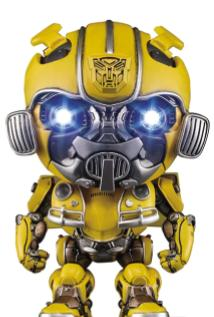
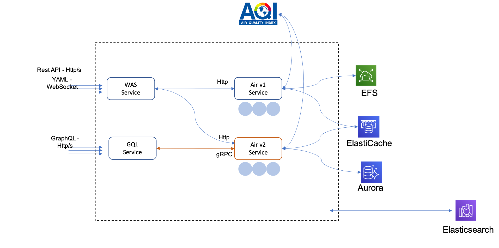

# Bumblebee  

It's a sample application, called Bumblebee,  to query air quality around world, which's designed as containerized microservices on Kubernetes. Developers can leverage that to experience various features on Kubernets, such DevOps tooling, observability components, service mesh, etc. 

## What's inside

- Containerized Microservices
- Multiple Language: Go / Typescript / Python
- Multiple protocols: WebSocket / GraphQL / gRPC / HTTP
- Integration with third parties with secret management
- Storage: Local files / MySQL / Caching (Redis)

## How to experiment 

Currently Bumblebee was running on environment, which's provisioned by [Mahjong](https://github.com/awslabs/aws-solutions-assembler) on AWS. Walk through following guides to trial out various features:

### CI/CD

### Blue/Green deployment
### Canary deployment
### Traffic management
### Observerbility: metrics, tracing, logs
### Load testing
### Secret management

