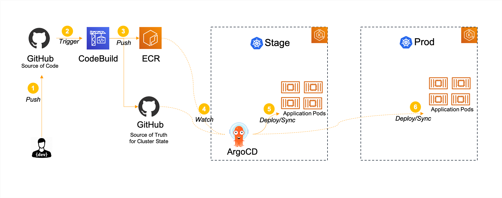

# CI/CD

## Automated release pipline

1. High-level diagram for automated release pipeline.



2. CI build up with AWS Codebuild.

3. CD handler bu ArgoCD. Go through the following steps to access ArgoCD console.

```bash

ARGOCD_ENDPOINT=`kubectl get svc argocd-server -n argocd -o json  |jq -r '.status.loadBalancer.ingress[].hostname'`
ARGOCD_WEB_URL=https://$ARGOCD_ENDPOINT/argocd

# Only for MacOS
open $ARGOCD_WEB_URL

# Otherwise you can copy URL from `echo $ARGOCD_WEB_URL` to your browser

```
Initial user and password are admin/argocd-server-cf87b5c86-5xlv2 to login into ArgoCD.


2. Modify code and trigger automated release pipeline
```bash
# Visit demo application
INGRESS_ENDPOINT=`kubectl -n istio-system get service istio-ingressgateway -o jsonpath='{.status.loadBalancer.ingress[0].hostname}'`

DEMO_URL_BJ=http://$INGRESS_ENDPOINT/air/v1/city/beijing
DEMO_URL_HK=http://$INGRESS_ENDPOINT/air/v1/city/hongkong

open $DEMO_URL_BJ
open $DEMO_URL_HK

# Modify code as you want, for example: AQI Standar API

git clone git@github.com:mahjong-contributions/go-bumblebee-jazz.git
cd go-bumblebee-jazz/src/air/apis/v1/
ls
vi handlerv1.go
#Go to AQIStandard(), modify content and save
git status
git add -A
git commit -m "chore: modify AQIStandard API for demo"
git push

# Once push to GitHub and automated pipeline will be triggered

```


## Blue/Green deployment with ArgoCD Rollouts 
## Canary deployment with ArgoCD Rollouts